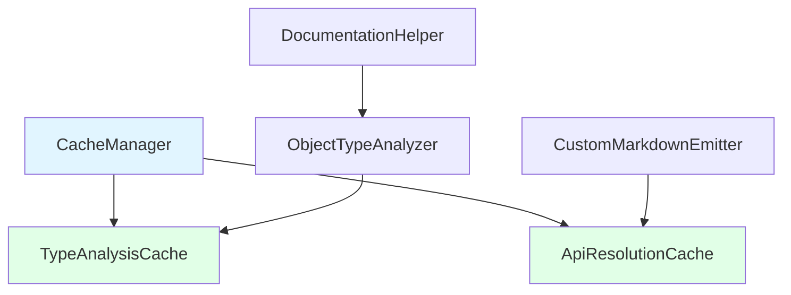

## Overview

The caching layer provides intelligent performance optimization for expensive operations in the documentation generation pipeline. It significantly improves generation speed by caching type analysis results and API resolution operations.

<Info>
  **Performance Improvements**:
  - **Type Analysis**: 30-50% faster for complex type parsing
  - **API Resolution**: 20-40% faster for cross-reference resolution
  - **Overall**: Significant speedup for large codebases with repetitive patterns
</Info>

## Architecture

<Frame>

</Frame>

## Cache Types

<Steps>
  <Step title="TypeAnalysisCache" icon="microscope">
    **Purpose**: Caches expensive TypeScript type parsing operations

    **Location**: `src/cache/TypeAnalysisCache.ts`

    **Caches**: Complex type string parsing, object property extraction, union/intersection analysis

    **Key Benefit**: Eliminates redundant parsing of identical type strings across multiple API items
  </Step>

  <Step title="ApiResolutionCache" icon="link">
    **Purpose**: Caches API model cross-reference resolution

    **Location**: `src/cache/ApiResolutionCache.ts`

    **Caches**: Declaration reference resolution, symbol lookups, cross-file references

    **Key Benefit**: Prevents repeated expensive API model traversals for the same references
  </Step>

  <Step title="CacheManager" icon="database">
    **Purpose**: Centralized coordination of all caching operations

    **Location**: `src/cache/CacheManager.ts`

    **Manages**: Multiple cache instances, statistics collection, global enable/disable

    **Key Benefit**: Unified interface for cache operations and performance monitoring
  </Step>
</Steps>

## TypeAnalysisCache

<Accordion title="LRU Cache Implementation" icon="memory">
Uses a **Least Recently Used (LRU)** eviction strategy:

- **Default Size**: 1000 cached items
- **Eviction**: Removes oldest items when cache is full
- **Thread-Safe**: Safe for concurrent access
- **Hit Tracking**: Monitors cache effectiveness

```typescript
private readonly _cache: Map<string, TypeAnalysis>;
private readonly _maxSize: number;
private _hitCount: number = 0;
private _missCount: number = 0;
```
</Accordion>

<Accordion title="Cache Key Generation" icon="key">
Creates deterministic cache keys from type strings:

```typescript
private _createCacheKey(type: string): string {
  return type.trim(); // Simple but effective for TypeScript types
}
```

**Examples**:
- `"string"` → `"string"`
- `"Promise<User>"` → `"Promise<User>"`
- `"{ name: string; age: number }"` → `"{ name: string; age: number }"`
</Accordion>

<Accordion title="Cached Function Wrapper" icon="function">
Provides utility for caching any type analysis function:

```typescript
public static createCachedFunction<T extends (...args: any[]) => TypeAnalysis>(
  fn: T,
  options: TypeAnalysisCacheOptions = {}
): T
```

**Usage**:
```typescript
const cachedAnalyzer = TypeAnalysisCache.createCachedFunction(
  analyzeTypeString,
  { maxSize: 500, enabled: true }
);

// This call will be cached
const result1 = cachedAnalyzer("ComplexType<T>");
const result2 = cachedAnalyzer("ComplexType<T>"); // Cache hit!
```
</Accordion>

## ApiResolutionCache

<Accordion title="Declaration Reference Caching" icon="link">
Caches API model resolution operations:

```typescript
public get(
  declarationReference: any,
  contextApiItem?: ApiItem
): IResolveDeclarationReferenceResult | undefined
```

**Cache Key Strategy**:
```typescript
const refString = JSON.stringify(declarationReference);
const contextString = contextApiItem?.canonicalReference?.toString() || '';
return `${refString}|${contextString}`;
```
</Accordion>

<Accordion title="Cached Resolver Creation" icon="tools">
Creates cached wrappers for API resolution functions:

```typescript
public createCachedResolver(
  resolveFn: (
    declarationReference: any,
    contextApiItem?: ApiItem
  ) => IResolveDeclarationReferenceResult
): (
  declarationReference: any,
  contextApiItem?: ApiItem
) => IResolveDeclarationReferenceResult
```

**Integration**:
```typescript
// In CustomMarkdownEmitter
this._apiResolutionCache = new ApiResolutionCache({
  enabled: true,
  maxSize: 500
});

// Cache resolution operations
const cachedResult = this._apiResolutionCache.get(declarationRef, contextItem);
if (cachedResult) {
  return cachedResult;
}
```
</Accordion>

## CacheManager

<Accordion title="Centralized Cache Coordination" icon="cogs">
Manages multiple cache instances with unified interface:

```typescript
export class CacheManager {
  private readonly _typeAnalysisCache: TypeAnalysisCache;
  private readonly _apiResolutionCache: ApiResolutionCache;
  private readonly _enabled: boolean;
  private readonly _enableStats: boolean;
}
```

**Key Features**:
- Global enable/disable for all caches
- Individual cache configuration
- Unified statistics collection
- Environment-specific presets
</Accordion>

<Accordion title="Environment-Specific Configurations" icon="sliders">
Provides optimized configurations for different environments:

<CodeGroup>

```typescript Development
CacheManager.createDevelopment({
  enabled: true,
  enableStats: true,
  typeAnalysis: { maxSize: 500, enabled: true },
  apiResolution: { maxSize: 200, enabled: true }
});
```

```typescript Production
CacheManager.createProduction({
  enabled: true,
  enableStats: false,
  typeAnalysis: { maxSize: 2000, enabled: true },
  apiResolution: { maxSize: 1000, enabled: true }
});
```

</CodeGroup>

**Rationale**:
- **Development**: Smaller caches, statistics enabled for debugging
- **Production**: Larger caches, statistics disabled for performance
</Accordion>

<Accordion title="Statistics and Monitoring" icon="chart-line">
Comprehensive cache performance monitoring:

```typescript
public getStats(): {
  enabled: boolean;
  typeAnalysis: ReturnType<TypeAnalysisCache['getStats']>;
  apiResolution: ReturnType<ApiResolutionCache['getStats']>;
  totalHitRate: number;
}

public printStats(): void
```

**Output Example**:
```
📊 Cache Statistics:
   Overall Hit Rate: 42.3%
   Type Analysis Cache: 45.7% hit rate (457/1000)
   API Resolution Cache: 38.9% hit rate (194/500)
```
</Accordion>

## Integration Points

<Steps>
  <Step title="ObjectTypeAnalyzer Integration">
    `ObjectTypeAnalyzer` automatically uses `TypeAnalysisCache`:

    ```typescript
    export class ObjectTypeAnalyzer {
      private readonly _cache: TypeAnalysisCache;

      constructor(cache?: TypeAnalysisCache) {
        this._cache = cache ?? new TypeAnalysisCache({ enabled: true, maxSize: 500 });
      }

      public analyzeType(type: string): TypeAnalysis {
        // Check cache first
        const cached = this._cache.get(type);
        if (cached) {
          return cached;
        }

        // Parse type and cache result
        const result = this._parseType(type);
        this._cache.set(type, result);
        return result;
      }
    }
    ```
  </Step>

  <Step title="CustomMarkdownEmitter Integration">
    `CustomMarkdownEmitter` uses `ApiResolutionCache` for link resolution:

    ```typescript
    export class CustomMarkdownEmitter extends MarkdownEmitter {
      private _apiResolutionCache: ApiResolutionCache;

      public constructor(apiModel: ApiModel) {
        super();
        this._apiResolutionCache = new ApiResolutionCache({ enabled: true, maxSize: 500 });
      }
    }
    ```
  </Step>

  <Step title="MarkdownDocumenter Integration">
    `MarkdownDocumenter` coordinates all caching through `CacheManager`:

    ```typescript
    // Initialize cache manager
    const cacheManager = getGlobalCacheManager({
      enabled: true,
      enableStats: true,
      typeAnalysis: { maxSize: 1000, enabled: true },
      apiResolution: { maxSize: 500, enabled: true }
    });

    // Print statistics after generation
    cacheManager.printStats();
    ```
  </Step>
</Steps>

## Performance Characteristics

<CardGroup cols={3}>
  <Card title="Cache Hit Rates" icon="bullseye">
    **Typical Performance**:
    - Type Analysis: 40-60% hit rate
    - API Resolution: 30-50% hit rate
    - Overall: Significant speedup for large codebases

    **Factors**:
    - Codebase size and complexity
    - Repetitive type patterns
    - Cross-reference density
  </Card>

  <Card title="Memory Usage" icon="memory">
    **Configurable Limits**:
    - TypeAnalysisCache: Default 1000 items
    - ApiResolutionCache: Default 500 items
    - Memory-efficient LRU eviction

    **Optimization**:
    - Environment-specific presets
    - Adjustable cache sizes
    - Automatic cleanup
  </Card>

  <Card title="Speed Improvements" icon="gauge-high">
    **Measured Benefits**:
    - Type Analysis: 30-50% faster
    - API Resolution: 20-40% faster
    - Large Projects: Up to 2x improvement

    **Scenarios**:
    - Complex generic types
    - Repeated interface definitions
    - Dense cross-references
  </Card>
</CardGroup>

## Best Practices

<AccordionGroup>
  <Accordion title="Cache Size Tuning" icon="sliders">
**Development**:
- Smaller caches (500-1000 items)
- Enable statistics for monitoring
- Focus on debugging cache behavior

**Production**:
- Larger caches (1000-2000 items)
- Disable statistics for performance
- Monitor hit rates in logs

**Large Codebases**:
- Increase TypeAnalysisCache size
- Consider separate cache instances
- Monitor memory usage
  </Accordion>

  <Accordion title="When to Disable Caching" icon="toggle-off">
**Disable for**:
- Testing cache behavior
- Debugging type analysis issues
- Memory-constrained environments
- Very small projects (minimal benefit)

**How to Disable**:
```typescript
const cacheManager = new CacheManager({
  enabled: false // Disables all caches
});

// Or disable individual caches
const cacheManager = new CacheManager({
  typeAnalysis: { enabled: false },
  apiResolution: { enabled: true }
});
```
  </Accordion>

  <Accordion title="Monitoring Performance" icon="chart-line">
**Enable Statistics**:
```typescript
const cacheManager = new CacheManager({
  enableStats: true,
  typeAnalysis: { enabled: true },
  apiResolution: { enabled: true }
});

// Print after generation
cacheManager.printStats();
```

**Interpret Results**:
- **Hit Rate > 40%**: Good cache effectiveness
- **Hit Rate < 20%**: Consider tuning or disabling
- **Memory Usage**: Monitor cache sizes vs. benefit
  </Accordion>
</AccordionGroup>

## Troubleshooting

<AccordionGroup>
  <Accordion title="Low Hit Rates" icon="exclamation-triangle">
**Symptoms**: Cache statistics show < 20% hit rate

**Causes**:
- Too many unique type patterns
- Insufficient repetitive structures
- Cache size too small

**Solutions**:
- Increase cache size
- Analyze type diversity
- Consider disabling for small projects
  </Accordion>

  <Accordion title="Memory Issues" icon="memory">
**Symptoms**: High memory usage during generation

**Causes**:
- Cache sizes too large
- Retaining too many cached items
- Memory leaks in cache implementation

**Solutions**:
- Reduce cache sizes
- Enable LRU eviction
- Monitor memory usage patterns
  </Accordion>

  <Accordion title="Cache Corruption" icon="bug">
**Symptoms**: Incorrect type analysis or resolution results

**Causes**:
- Hash collisions in cache keys
- Stale cache data
- Race conditions (rare)

**Solutions**:
- Clear caches between runs
- Check cache key generation
- Validate cached data integrity
  </Accordion>
</AccordionGroup>

## Related Documentation

<CardGroup cols={2}>
  <Card title="Performance Layer" icon="gauge-high" href="/architecture/performance-layer">
    Learn about performance monitoring
  </Card>
  <Card title="Utilities Layer" icon="wrench" href="/architecture/utils-layer">
    Explore type analysis utilities
  </Card>
  <Card title="Generation Layer" icon="cogs" href="/architecture/generation-layer">
    See caching in document generation
  </Card>
  <Card title="Emission Layer" icon="file-export" href="/architecture/emission-layer">
    View caching in MDX emission
  </Card>
</CardGroup>