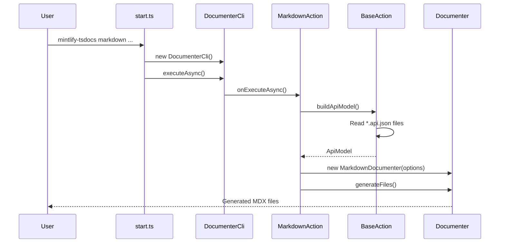

## Overview

The CLI layer is the entry point for `mintlify-tsdocs`, responsible for parsing user commands and initiating the documentation generation process. Built on `@rushstack/ts-command-line`, it provides a robust, typed command-line interface.

<Info>
  **Entry Point**: `src/start.ts` creates the CLI instance and runs the parser
</Info>

## Component Architecture

<Tabs>
  <Tab title="start.ts">
    **The Executable Entry Point**

    ```typescript src/start.ts
    import { DocumenterCli } from './cli/ApiDocumenterCommandLine';

    const parser: DocumenterCli = new DocumenterCli();
    parser.executeAsync().catch(console.error);
    ```

    Responsibilities:
    - Display version banner
    - Create CLI parser instance
    - Execute command and handle errors
  </Tab>

  <Tab title="ApiDocumenterCommandLine">
    **Main CLI Parser**

    Configures the tool's identity and registers available commands.

    ```typescript
    export class DocumenterCli extends CommandLineParser {
      constructor() {
        super({
          toolFilename: 'mintlify-tsdocs',
          toolDescription: 'Generates Mintlify-compatible MDX documentation'
        });
        this._populateActions();
      }

      private _populateActions(): void {
        this.addAction(new MarkdownAction(this));
      }
    }
    ```

    Currently registers only the `markdown` action.
  </Tab>

  <Tab title="BaseAction">
    **Abstract Action Base**

    Provides foundational functionality for all actions.

    **Key Method**: `buildApiModel()`

    <Steps>
      <Step title="Parse Parameters">
        Reads `--input-folder` and `--output-folder`
      </Step>
      <Step title="Validate Input">
        Ensures input folder exists
      </Step>
      <Step title="Create ApiModel">
        Instantiates model from `@microsoft/api-extractor-model`
      </Step>
      <Step title="Load Packages">
        Finds all `*.api.json` files and loads them
      </Step>
      <Step title="Apply Workarounds">
        Handles `@inheritDoc` TSDoc tags
      </Step>
    </Steps>
  </Tab>

  <Tab title="MarkdownAction">
    **Concrete Implementation**

    Implements the `markdown` command with Mintlify-specific parameters.

    **CLI Parameters Defined:**

    <ParamField path="input-folder" type="string" required>
      Folder containing `*.api.json` files (default: `./input`)
    </ParamField>

    <ParamField path="output-folder" type="string" required>
      Output folder for MDX files - **contents will be deleted!** (default: `./markdown`)
    </ParamField>

    <ParamField path="docs-json" type="string">
      Path to Mintlify `docs.json` file to update with navigation
    </ParamField>

    <ParamField path="tab-name" type="string">
      Tab name in Mintlify navigation (default: "API Reference")
    </ParamField>

    <ParamField path="group" type="string">
      Group name within the tab for organizing pages
    </ParamField>

    <ParamField path="menu" type="boolean">
      Enable menu for the group in navigation
    </ParamField>

    <ParamField path="readme" type="boolean">
      Convert project `README.md` to `index.mdx`
    </ParamField>

    <ParamField path="readme-title" type="string">
      Custom title for the README page (only with `--readme`)
    </ParamField>
  </Tab>
</Tabs>

## Execution Flow

<Frame>

</Frame>

## Detailed Flow Breakdown

<AccordionGroup>
  <Accordion title="1. Command Invocation" icon="play">
    User runs the command:
    ```bash
    mintlify-tsdocs markdown -i ./temp -o ./docs/api --docs-json ./docs/docs.json
    ```

    - Binary executes `lib/start.js`
    - Version banner is displayed
    - `DocumenterCli` instance is created
  </Accordion>

  <Accordion title="2. CLI Parsing" icon="gears">
    `DocumenterCli.executeAsync()` processes the command:

    - Identifies action: `markdown`
    - Validates required parameters
    - Parses all flags and values
    - Routes to `MarkdownAction.onExecuteAsync()`
  </Accordion>

  <Accordion title="3. API Model Building" icon="database">
    `BaseAction.buildApiModel()` loads the API data:

    ```typescript
    const apiModel: ApiModel = new ApiModel();
    const inputFolder = this._inputFolderParameter.value || './input';

    // Find and load all *.api.json files
    for (const filename of FileSystem.readFolderItemNames(inputFolder)) {
      if (filename.match(/\.api\.json$/i)) {
        apiModel.loadPackage(path.join(inputFolder, filename));
      }
    }

    // Apply @inheritDoc workarounds
    this._applyInheritDoc(apiModel, apiModel);

    return { apiModel, inputFolder, outputFolder };
    ```
  </Accordion>

  <Accordion title="4. Documenter Instantiation" icon="file-code">
    `MarkdownAction` creates and configures the documenter:

    ```typescript
    const markdownDocumenter = new MarkdownDocumenter({
      apiModel,
      outputFolder,
      docsJsonPath: this._docsJsonParameter.value,
      tabName: this._tabNameParameter.value,
      groupName: this._groupParameter.value,
      enableMenu: this._menuParameter.value,
      convertReadme: this._readmeParameter.value,
      readmeTitle: this._readmeTitleParameter.value || 'README'
    });
    ```
  </Accordion>

  <Accordion title="5. Generation Handoff" icon="rocket">
    Control passes to the generation layer:
    ```typescript
    markdownDocumenter.generateFiles();
    ```

    The CLI layer's work is complete - the generation layer takes over.
  </Accordion>
</AccordionGroup>

## Parameter Validation

The CLI layer ensures all parameters are valid before proceeding:

<CodeGroup>

```typescript Input Folder Validation
const inputFolder = this._inputFolderParameter.value || './input';
if (!FileSystem.exists(inputFolder)) {
  throw new Error('The input folder does not exist: ' + inputFolder);
}
```

```typescript Output Folder Preparation
const outputFolder = this._outputFolderParameter.value || './markdown';
FileSystem.ensureFolder(outputFolder);
```

```typescript API File Detection
const apiJsonFiles = FileSystem.readFolderItemNames(inputFolder)
  .filter(f => f.match(/\.api\.json$/i));

if (apiJsonFiles.length === 0) {
  throw new Error('No *.api.json files found in input folder');
}
```

</CodeGroup>

## Error Handling

<Warning>
  The CLI layer provides early validation to fail fast with clear error messages
</Warning>

Common errors caught at the CLI layer:

| Error | Cause | Solution |
|-------|-------|----------|
| Input folder not found | Invalid `-i` path | Verify path exists |
| No .api.json files | Wrong input folder | Run `api-extractor` first |
| Invalid docs.json | Malformed JSON | Validate JSON syntax |
| Permission denied | Output folder protected | Check file permissions |

## Extending the CLI

### Adding a New Parameter

<Steps>
  <Step title="Define in Action">
    ```typescript
    this._myParameter = this.defineStringParameter({
      parameterLongName: '--my-option',
      argumentName: 'VALUE',
      description: 'My new option'
    });
    ```
  </Step>

  <Step title="Pass to Documenter">
    ```typescript
    const markdownDocumenter = new MarkdownDocumenter({
      // ... existing options
      myOption: this._myParameter.value
    });
    ```
  </Step>

  <Step title="Update Interface">
    ```typescript
    export interface IMarkdownDocumenterOptions {
      // ... existing properties
      myOption?: string;
    }
    ```
  </Step>

  <Step title="Use in Generation">
    Use the new option in `MarkdownDocumenter` logic
  </Step>
</Steps>

### Adding a New Command

To add a new command (e.g., `yaml`):

1. Create `YamlAction.ts` extending `BaseAction`
2. Implement `onExecuteAsync()`
3. Register in `ApiDocumenterCommandLine._populateActions()`

```typescript
private _populateActions(): void {
  this.addAction(new MarkdownAction(this));
  this.addAction(new YamlAction(this));  // New command
}
```

## Related Documentation

<CardGroup cols={2}>
  <Card title="Generation Layer" icon="cogs" href="/architecture/generation-layer">
    See how the CLI hands off to the generation layer
  </Card>
  <Card title="Architecture Overview" icon="sitemap" href="/architecture/overview">
    Understand the full pipeline
  </Card>
</CardGroup>
