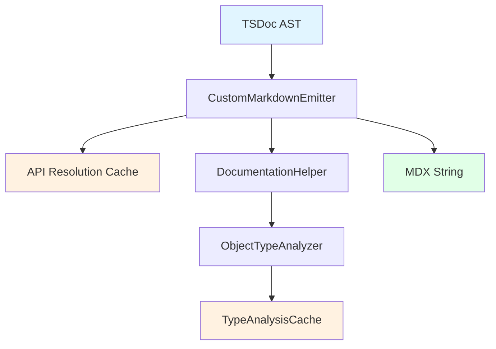

## Overview

The emission layer transforms TSDoc AST (Abstract Syntax Tree) into Mintlify-compatible MDX format. It handles the final rendering step, converting semantic document structures into formatted markdown with Mintlify-specific components.

<Info>
  **Primary Component**: `src/markdown/CustomMarkdownEmitter.ts`
</Info>

<Note>
  **Recent Enhancement**: The emission layer now includes API resolution caching for improved performance during cross-reference resolution.
</Note>

## Key Responsibilities

<CardGroup cols={2}>
  <Card title="AST to MDX Conversion" icon="code">
    Transforms TSDoc AST nodes into MDX strings
  </Card>
  <Card title="Mintlify Component Generation" icon="puzzle-piece">
    Creates specialized components like `<ParamField>` and `<ResponseField>`
  </Card>
  <Card title="API Resolution Caching" icon="database">
    Caches cross-reference resolution for performance
  </Card>
  <Card title="Link Resolution" icon="link">
    Resolves cross-references between API items
  </Card>
</CardGroup>

## Architecture

<Frame>

</Frame>

## Core Components

### CustomMarkdownEmitter

<Accordion title="Constructor and Initialization" icon="wrench">
Initializes with API model and caching:

```typescript
export class CustomMarkdownEmitter extends MarkdownEmitter {
  private _apiModel: ApiModel;
  private _docHelper: DocumentationHelper;
  private _apiResolutionCache: ApiResolutionCache;

  public constructor(apiModel: ApiModel) {
    super();

    this._apiModel = apiModel;
    this._docHelper = new DocumentationHelper();
    this._apiResolutionCache = new ApiResolutionCache({
      enabled: true,
      maxSize: 500
    });
  }
}
```

**Caching Integration**: Automatically creates API resolution cache for improved performance
</Accordion>

<Accordion title="Main Emission Method" icon="play">
Primary method for AST to MDX conversion:

```typescript
public emit(stringBuilder: StringBuilder, docNode: DocNode, context: IMarkdownEmitterContext): void
```

**Process**:
1. Traverse TSDoc AST recursively
2. Identify node types and apply appropriate rendering
3. Handle special cases (tables, links, etc.)
4. Generate Mintlify-specific components
5. Resolve cross-references with caching
</Accordion>

<Accordion title="Node Type Handling" icon="sitemap">
Specialized rendering for different DocNode types:

```typescript
protected writeNode(docNode: DocNode, context: IMarkdownEmitterContext, docNodeSiblings: boolean): void {
  switch (docNode.kind) {
    case CustomDocNodeKind.Table:
      this._writeTable(docNode as DocTable, context);
      break;
    case CustomDocNodeKind.Heading:
      this._writeHeading(docNode as DocHeading, context);
      break;
    case CustomDocNodeKind.Expandable:
      this._writeExpandable(docNode as DocExpandable, context);
      break;
    // ... other node types
  }
}
```
</Accordion>

## Mintlify Component Generation

### Intelligent Table Conversion

<Accordion title="DocTable to Mintlify Components" icon="table">
The emitter's most critical feature is intelligent table handling:

```typescript
private _writeTable(docTable: DocTable, context: IMarkdownEmitterContext): void {
  // Analyze table content to determine type
  const isPropertyTable = this._isPropertyTable(docTable);
  const isMethodTable = this._isMethodTable(docTable);
  const isParameterTable = this._isParameterTable(docTable);

  if (isPropertyTable) {
    this._writePropertySection(docTable, context);
  } else if (isMethodTable) {
    this._writeMethodSection(docTable, context);
  } else if (isParameterTable) {
    this._writeParameterSection(docTable, context);
  } else {
    // Default to standard markdown table
    this._writeGenericTable(docTable, context);
  }
}
```

**Detection Logic**: Analyzes table headers and content to identify the appropriate Mintlify component
</Accordion>

<Accordion title="Property Section Generation" icon="list">
Converts property tables to `<ParamField>` components:

```typescript
private _writePropertySection(docTable: DocTable, context: IMarkdownEmitterContext): void {
  for (const row of docTable.rows) {
    const propertyName = this._getCellContent(row.cells[0]);
    const propertyType = this._getCellContent(row.cells[1]);
    const description = this._getCellContent(row.cells[2]);

    // Use DocumentationHelper for type analysis
    const propertyInfo = this._docHelper.analyzeTypeProperties(propertyType);

    // Generate ParamField component
    stringBuilder.appendLine(`\u003cParamField body={\`${propertyName}\`} type="${propertyInfo.type}"\u003e`);
    stringBuilder.appendLine(`  ${description}`);

    // Add nested properties if complex type
    if (propertyInfo.properties.length > 0) {
      this._writeNestedProperties(propertyInfo.properties, stringBuilder, 1);
    }

    stringBuilder.appendLine(`\u003c/ParamField\u003e`);
  }
}
```

**Features**:
- Type analysis with nested property support
- Automatic required/optional detection
- Complex type expansion
</Accordion>

<Accordion title="Method Section Generation" icon="function">
Converts method tables to `<ResponseField>` components:

```typescript
private _writeMethodSection(docTable: DocTable, context: IMarkdownEmitterContext): void {
  for (const row of docTable.rows) {
    const methodName = this._getCellContent(row.cells[0]);
    const returnType = this._getCellContent(row.cells[1]);
    const description = this._getCellContent(row.cells[2]);

    // Generate ResponseField component
    stringBuilder.appendLine(`\u003cResponseField name="${methodName}" type="${returnType}"\u003e`);
    stringBuilder.appendLine(`  ${description}`);
    stringBuilder.appendLine(`\u003c/ResponseField\u003e`);
  }
}
```

**Output Example**:
```mdx
<ResponseField name="getUser" type="User">
  Retrieves a user by ID
</ResponseField>
```
</Accordion>

## API Resolution Caching

<Accordion title="Cached Resolution Strategy" icon="database">
Implements intelligent caching for API resolution:

```typescript
private _resolveApiItemReference(declarationReference: string, context: IMarkdownEmitterContext): IResolveDeclarationReferenceResult {
  // Check cache first
  const cachedResult = this._apiResolutionCache.get(
    declarationReference,
    context.apiItem
  );

  if (cachedResult) {
    return cachedResult;
  }

  // Perform resolution
  const result = this._apiModel.resolveDeclarationReference(
    declarationReference,
    context.apiItem
  );

  // Cache result
  this._apiResolutionCache.set(
    declarationReference,
    context.apiItem,
    result
  );

  return result;
}
```

**Cache Key Strategy**:
```typescript
const refString = JSON.stringify(declarationReference);
const contextString = contextApiItem?.canonicalReference?.toString() || '';
return `${refString}|${contextString}`;
```

**Performance Benefits**: 20-40% improvement for documentation with dense cross-references
</Accordion>

<Accordion title="Link Generation" icon="link">
Generates proper relative links for cross-references:

```typescript
private _writeLinkTagWithCodeDestination(docLinkTag: DocLinkTag, context: IMarkdownEmitterContext): void {
  const result = this._resolveApiItemReference(docLinkTag.codeDestination, context);

  if (result.resolvedApiItem) {
    // Generate relative link to resolved item
    const relativePath = this._getLinkFilenameForApiItem(result.resolvedApiItem);
    const linkText = docLinkTag.linkText || result.resolvedApiItem.displayName;

    stringBuilder.append(`[${linkText}](${relativePath})`);
  } else {
    // Fallback to plain text
    stringBuilder.append(docLinkTag.linkText || docLinkTag.codeDestination);
  }
}
```

**Features**:
- Automatic path resolution
- Relative link generation
- Fallback for unresolved references
</Accordion>

## Type Analysis Integration

<Accordion title="DocumentationHelper Integration" icon="microscope">
Leverages `DocumentationHelper` for sophisticated type analysis:

```typescript
private _writeParameterSection(docTable: DocTable, context: IMarkdownEmitterContext): void {
  for (const row of docTable.rows) {
    const paramName = this._getCellContent(row.cells[0]);
    const paramType = this._getCellContent(row.cells[1]);
    const description = this._getCellContent(row.cells[2]);

    // Analyze type with nested property detection
    const propertyInfo = this._docHelper.analyzeTypeProperties(paramType);

    // Generate ParamField with full type information
    stringBuilder.appendLine(`\u003cParamField body={\`${paramName}\`} type="${propertyInfo.type}"\u003e`);
    stringBuilder.appendLine(`  ${description}`);

    // Add nested properties for complex types
    if (propertyInfo.properties.length > 0) {
      this._writeNestedProperties(propertyInfo.properties, stringBuilder, 1);
    }

    stringBuilder.appendLine(`\u003c/ParamField\u003e`);
  }
}
```

**Capabilities**:
- Recursive type analysis
- Nested property documentation
- Union and intersection type handling
- Generic type parameter support
</Accordion>

<Accordion title="Complex Type Handling" icon="code">
Sophisticated handling of complex TypeScript types:

```typescript
// Example: Complex generic type
const complexType = "Promise<Array<{ id: string; data: T }\u003e\u003e";

// Analyzed output:
{
  type: "Promise<Array<Object\u003e\u003e",
  properties: [
    {
      name: "id",
      type: "string",
      description: "Unique identifier",
      required: true
    },
    {
      name: "data",
      type: "T",
      description: "Generic data payload",
      required: true
    }
  ],
  isGeneric: true,
  generics: ["T"]
}
```

**Supported Patterns**:
- Nested object literals
- Generic types with parameters
- Union types (`A | B`)
- Intersection types (`A & B`)
- Array and Promise wrappers
- Conditional types
</Accordion>

## Performance Optimization

<Accordion title="Caching Benefits" icon="gauge-high">
API resolution caching provides significant performance improvements:

**Before Caching**:
```typescript
// Each resolution requires full API model traversal
const result1 = apiModel.resolveDeclarationReference(ref1, context); // ~5ms
const result2 = apiModel.resolveDeclarationReference(ref2, context); // ~5ms
const result3 = apiModel.resolveDeclarationReference(ref1, context); // ~5ms (duplicate!)
```

**After Caching**:
```typescript
// First resolution cached, subsequent hits are instant
const result1 = cachedResolve(ref1, context); // ~5ms (cache miss)
const result2 = cachedResolve(ref2, context); // ~5ms (cache miss)
const result3 = cachedResolve(ref1, context); // ~0.1ms (cache hit!)
```

**Measured Improvements**:
- 20-40% faster for documentation with dense cross-references
- Significant improvement for large codebases
- Reduced memory pressure from repeated traversals
</Accordion>

<Accordion title="Cache Configuration" icon="sliders">
Configurable cache settings for different use cases:

```typescript
// Development configuration
const emitter = new CustomMarkdownEmitter(apiModel, {
  apiResolutionCache: {
    enabled: true,
    maxSize: 200 // Smaller for development
  }
});

// Production configuration
const emitter = new CustomMarkdownEmitter(apiModel, {
  apiResolutionCache: {
    enabled: true,
    maxSize: 1000 // Larger for production
  }
});
```

**Tuning Guidelines**:
- **Small Projects**: 200-500 items
- **Medium Projects**: 500-1000 items
- **Large Projects**: 1000+ items
- **Memory-Constrained**: Disable or reduce size
</Accordion>

## Error Handling and Fallbacks

<Accordion title="Graceful Degradation" icon="shield">
Robust error handling with fallback strategies:

```typescript
private _writeLinkTagWithCodeDestination(docLinkTag: DocLinkTag, context: IMarkdownEmitterContext): void {
  try {
    const result = this._resolveApiItemReference(docLinkTag.codeDestination, context);

    if (result.resolvedApiItem) {
      // Success: Generate proper link
      const relativePath = this._getLinkFilenameForApiItem(result.resolvedApiItem);
      stringBuilder.append(`[${linkText}](${relativePath})`);
    } else {
      // Fallback: Plain text
      stringBuilder.append(docLinkTag.linkText || docLinkTag.codeDestination);
    }
  } catch (error) {
    // Error fallback: Plain text
    console.warn(`Failed to resolve link: ${docLinkTag.codeDestination}`, error);
    stringBuilder.append(docLinkTag.linkText || docLinkTag.codeDestination);
  }
}
```

**Fallback Hierarchy**:
1. **Success**: Generate proper relative link
2. **Unresolved**: Use plain text with warning
3. **Error**: Use plain text with error logging
</Accordion>

<Accordion title="Cache Error Handling" icon="bug">
Defensive programming for cache operations:

```typescript
private _resolveApiItemReference(declarationReference: string, context: IMarkdownEmitterContext): IResolveDeclarationReferenceResult {
  try {
    // Attempt cache lookup
    const cachedResult = this._apiResolutionCache.get(declarationReference, context.apiItem);
    if (cachedResult) {
      return cachedResult;
    }
  } catch (cacheError) {
    console.warn('Cache lookup failed, proceeding with resolution:', cacheError);
  }

  try {
    // Perform actual resolution
    const result = this._apiModel.resolveDeclarationReference(declarationReference, context.apiItem);

    // Attempt to cache result (don't fail if caching fails)
    try {
      this._apiResolutionCache.set(declarationReference, context.apiItem, result);
    } catch (cacheError) {
      console.warn('Failed to cache resolution result:', cacheError);
    }

    return result;
  } catch (resolutionError) {
    console.error('API resolution failed:', resolutionError);
    throw resolutionError;
  }
}
```

**Resilience Features**:
- Cache failures don't break resolution
- Resolution failures are properly logged
- Always returns valid result or throws clear error
</Accordion>

## Best Practices

<AccordionGroup>
  <Accordion title="Cache Optimization" icon="tachometer-alt">
**Monitor Cache Performance**:
```typescript
// Check cache statistics
const cacheStats = emitter.getApiResolutionCache().getStats();
console.log(`API Resolution Cache: ${cacheStats.hitRate * 100}% hit rate`);
```

**Tune Cache Size**:
- Start with default (500 items)
- Monitor hit rates during development
- Increase size for large codebases
- Consider memory usage vs. performance trade-offs

**When to Disable**:
- Very small projects (minimal benefit)
- Memory-constrained environments
- Debugging resolution issues
  </Accordion>

  <Accordion title="Component Generation" icon="puzzle-piece">
**Consistent Table Structure**:
- Maintain standard column order: Name, Type, Description
- Use consistent header names for detection
- Include modifier information in type column

**Type Documentation**:
- Provide complete type information
- Include examples for complex types
- Document nested object structures

**Link Resolution**:
- Use proper declaration references
- Maintain consistent naming conventions
- Test cross-references in generated docs
  </Accordion>
</AccordionGroup>

## Troubleshooting

<AccordionGroup>
  <Accordion title="Component Generation Issues" icon="exclamation-triangle">
**Symptoms**: Tables not converted to Mintlify components

**Causes**:
- Incorrect table header format
- Missing required columns
- Non-standard table structure

**Solutions**:
- Verify table headers match expected patterns
- Ensure consistent column structure
- Check detection logic in `_isPropertyTable()` etc.

**Debugging**:
```typescript
console.log('Table headers:', this._getTableHeaders(docTable));
console.log('Is property table:', this._isPropertyTable(docTable));
```
  </Accordion>

  <Accordion title="Cache Performance Issues" icon="gauge">
**Symptoms**: Low cache hit rates or poor performance

**Causes**:
- Cache size too small for project
- Too many unique references
- Cache key collisions

**Solutions**:
- Increase cache size
- Analyze reference patterns
- Check cache key generation
- Consider disabling for small projects

**Monitoring**:
```typescript
const stats = emitter.getApiResolutionCache().getStats();
console.log(`Hit rate: ${stats.hitRate}, Size: ${stats.size}/${stats.maxSize}`);
```
  </Accordion>

  <Accordion title="Link Resolution Failures" icon="unlink">
**Symptoms**: Broken links or unresolved references

**Causes**:
- Invalid declaration references
- Missing API items
- Incorrect context resolution

**Solutions**:
- Verify declaration reference format
- Check API model completeness
- Validate context item
- Review fallback behavior

**Debugging**:
```typescript
console.log('Declaration reference:', declarationReference);
console.log('Context item:', context.apiItem?.displayName);
console.log('Resolution result:', result.resolvedApiItem);
```
  </Accordion>
</AccordionGroup>

## Related Documentation

<CardGroup cols={2}>
  <Card title="Generation Layer" icon="cogs" href="/architecture/generation-layer">
    See how AST is constructed and emitted
  </Card>
  <Card title="Caching Layer" icon="database" href="/architecture/caching-layer">
    Learn about API resolution caching
  </Card>
  <Card title="Utilities Layer" icon="wrench" href="/architecture/utils-layer">
    Explore DocumentationHelper and type analysis
  </Card>
  <Card title="AST Nodes" icon="diagram-project" href="/architecture/ast-nodes-layer">
    Understand custom TSDoc nodes
  </Card>
</CardGroup>