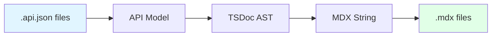
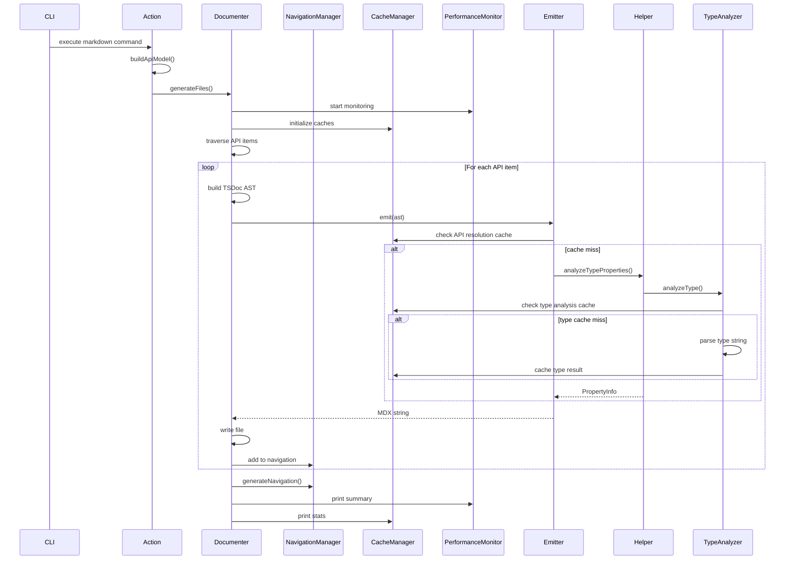

## Introduction

`mintlify-tsdocs` transforms structured API data into beautiful Mintlify documentation through a multi-stage pipeline.

<Frame>

</Frame>

## Core Libraries

The tool is built on three foundational libraries from Microsoft's Rush Stack:

<CardGroup cols={3}>
  <Card title="ts-command-line" icon="terminal">
    Command-line interface framework with typed parameters and actions
  </Card>
  <Card title="api-extractor-model" icon="database">
    Loads `.api.json` files into a traversable object model (`ApiModel`)
  </Card>
  <Card title="tsdoc" icon="file-code">
    Creates an Abstract Syntax Tree (AST) of documentation content
  </Card>
</CardGroup>

## Component Layers

The codebase is organized into distinct layers, each with a specific responsibility:

<Steps>
  <Step title="CLI Layer" icon="terminal">
    **Location**: `src/cli/`

    Parses user commands and initializes the documentation generation process.

    - `start.ts` - Executable entry point
    - `ApiDocumenterCommandLine.ts` - Main CLI parser
    - `BaseAction.ts` - Common action functionality
    - `MarkdownAction.ts` - Mintlify-specific command implementation
  </Step>

  <Step title="Generation Layer" icon="cogs">
    **Location**: `src/documenters/`

    Orchestrates the conversion from API model to documentation pages.

    - `MarkdownDocumenter.ts` - Core orchestrator (now modular)
    - Builds TSDoc AST for each page
    - Delegates navigation to `NavigationManager`
    - Integrates performance monitoring and caching
  </Step>

  <Step title="Emission Layer" icon="file-export">
    **Location**: `src/markdown/`

    Serializes the TSDoc AST into Mintlify-compatible MDX.

    - `CustomMarkdownEmitter.ts` - Mintlify-specific rendering with API resolution caching
    - `MarkdownEmitter.ts` - Base markdown functionality
    - Generates `<ParamField>` and `<ResponseField>` components
  </Step>

  <Step title="Navigation Layer" icon="map">
    **Location**: `src/navigation/`

    Dedicated navigation management for Mintlify documentation.

    - `NavigationManager.ts` - Hierarchical navigation generation
    - `docs.json` structure management
    - Mintlify v4 compatibility
    - API item categorization
  </Step>

  <Step title="Caching Layer" icon="database">
    **Location**: `src/cache/`

    Performance optimization through intelligent caching.

    - `CacheManager.ts` - Centralized cache coordination
    - `TypeAnalysisCache.ts` - Caches expensive type parsing operations
    - `ApiResolutionCache.ts` - Caches API model cross-reference resolution
    - LRU eviction with configurable sizes
  </Step>

  <Step title="Performance Layer" icon="gauge-high">
    **Location**: `src/performance/`

    Performance monitoring and metrics collection.

    - `PerformanceMonitor.ts` - Execution time tracking
    - Operation-level metrics
    - Statistics reporting
  </Step>

  <Step title="Utilities & Nodes" icon="puzzle-piece">
    **Location**: `src/utils/`, `src/nodes/`

    Supporting components for type analysis and AST nodes.

    - Custom TSDoc nodes (`DocTable`, `DocHeading`, etc.)
    - Type analysis utilities (`ObjectTypeAnalyzer` with caching)
    - Documentation helpers (`DocumentationHelper`)
    - Security utilities and error handling
  </Step>
</Steps>

## Data Flow

<Accordion title="Detailed Pipeline Flow" icon="flow">

### 1. CLI Parsing
User runs `mintlify-tsdocs markdown ...`
- `start.ts` creates `DocumenterCli` instance
- CLI parser invokes `MarkdownAction.onExecuteAsync()`
- Parameters are validated and processed

### 2. API Model Building
`BaseAction.buildApiModel()` loads the API data:
- Reads all `*.api.json` files from input folder
- Creates `ApiModel` instance
- Loads each package into the model
- Applies `@inheritDoc` workarounds

### 3. Document Generation
`MarkdownDocumenter.generateFiles()` orchestrates:
- Deletes old output files
- Traverses API model recursively
- Calls `_writeApiItemPage()` for each item
- Builds TSDoc AST (not markdown strings!)

### 4. AST Construction
For each page, `MarkdownDocumenter`:
- Creates `DocSection` root node
- Adds `DocHeading` for titles
- Creates `DocTable` nodes for member lists
- Builds `DocTableRow` and `DocTableCell` for each member
- This AST represents semantic structure

### 5. MDX Emission
`CustomMarkdownEmitter.emit()` serializes the AST:
- Traverses TSDoc AST recursively
- Identifies `DocTable` nodes with properties/methods
- Calls `DocumentationHelper` for type analysis
- Generates Mintlify components
- Writes formatted MDX string

### 6. Navigation Update
`NavigationManager.generateNavigation()`:
- Reads existing `docs.json`
- Merges new page paths hierarchically
- Organizes by API item categories
- Supports Mintlify v4 tab structure
- Writes updated `docs.json`

### 7. Performance Monitoring
`PerformanceMonitor` tracks:
- Operation execution times
- Cache hit rates
- Generation statistics
- Prints summary report

### 8. Cache Statistics
`CacheManager.printStats()` reports:
- Type analysis cache performance
- API resolution cache performance
- Overall hit rates and usage

</Accordion>

## Key Components Deep Dive

<AccordionGroup>
  <Accordion title="MarkdownDocumenter" icon="file-code">
    **The Central Orchestrator**

    Responsibilities:
    - File management (delete old, write new)
    - API traversal (recursive iteration)
    - AST construction (build document structure)
    - Frontmatter generation (YAML blocks)
    - Navigation management (docs.json updates)

    **Key Method**: `_writeApiItemPage()` - Generates a single documentation page
  </Accordion>

  <Accordion title="CustomMarkdownEmitter" icon="paintbrush">
    **The Mintlify Renderer**

    Responsibilities:
    - TSDoc AST → MDX conversion
    - Custom node rendering
    - Mintlify component generation
    - Link resolution
    - Type analysis integration

    **Key Feature**: Intelligent `DocTable` conversion to `<ParamField>`/`<ResponseField>` components
  </Accordion>

  <Accordion title="DocumentationHelper" icon="life-ring">
    **The Type Analyzer**

    Responsibilities:
    - Parse TypeScript type strings
    - Extract nested object properties
    - Enrich with JSDoc descriptions
    - Generate property metadata

    **Key Method**: `analyzeTypeProperties()` - Recursively analyzes complex types
  </Accordion>

  <Accordion title="NavigationManager" icon="map">
    **The Navigation Orchestrator**

    Responsibilities:
    - Hierarchical navigation generation
    - API item categorization (Classes, Interfaces, Functions, etc.)
    - Mintlify v4 tab structure support
    - docs.json management with validation
    - Duplicate prevention and path normalization

    **Key Feature**: Automatic categorization by API item type with configurable icons
  </Accordion>

  <Accordion title="CacheManager" icon="database">
    **The Performance Optimizer**

    Responsibilities:
    - Centralized cache coordination
    - Type analysis caching (30-50% performance improvement)
    - API resolution caching (20-40% performance improvement)
    - LRU eviction with configurable sizes
    - Hit rate monitoring and statistics

    **Key Feature**: Intelligent caching with environment-specific configurations
  </Accordion>

  <Accordion title="PerformanceMonitor" icon="gauge-high">
    **The Metrics Collector**

    Responsibilities:
    - Operation execution time tracking
    - Performance statistics collection
    - Summary reporting with detailed metrics
    - Error-aware timing (includes failed operations)

    **Key Feature**: Detailed performance insights for optimization
  </Accordion>

  <Accordion title="ObjectTypeAnalyzer" icon="microscope">
    **The Type Parser** (now with caching)

    Handles all TypeScript type patterns:
    - Primitives (`string`, `number`)
    - Arrays (`string[]`)
    - Unions (`A | B`)
    - Intersections (`A & B`)
    - Generics (`Promise<T>`)
    - Object literals (`{ a: string; b: number }`)

    **New**: Integrated with TypeAnalysisCache for 30-50% performance improvement
    Returns structured `TypeAnalysis` objects for processing
  </Accordion>
</AccordionGroup>

## Custom TSDoc Nodes

We extend the standard TSDoc nodes with custom types:

<Tabs>
  <Tab title="DocHeading">
    Represents section headings with levels (h1-h4)

    ```typescript
    interface DocHeading {
      title: string;
      level: number; // 1-4
    }
    ```
  </Tab>

  <Tab title="DocTable">
    Represents complete tables - the most important custom node!

    ```typescript
    interface DocTable {
      header: DocTableRow;
      rows: DocTableRow[];
    }
    ```

    The emitter inspects tables to decide whether to render as HTML `<table>` or Mintlify components.
  </Tab>

  <Tab title="DocExpandable">
    Represents Mintlify `<Expandable>` components for nested properties

    ```typescript
    interface DocExpandable {
      title: string;
      content: DocSection;
    }
    ```
  </Tab>

  <Tab title="DocNoteBox">
    Represents note/warning boxes (rendered as blockquotes)

    ```typescript
    interface DocNoteBox {
      content: DocSection;
    }
    ```
  </Tab>
</Tabs>

## How to Contribute

Understanding the pipeline helps you contribute effectively:

<CardGroup cols={2}>
  <Card title="Change MDX Output" href="/architecture/emission-layer">
    Modify `CustomMarkdownEmitter` or `DocumentationHelper`
  </Card>
  <Card title="Change Page Structure" href="/architecture/generation-layer">
    Modify `MarkdownDocumenter` and AST construction
  </Card>
  <Card title="Add CLI Options" href="/architecture/cli-layer">
    Start in `MarkdownAction`, pass to `MarkdownDocumenter`
  </Card>
  <Card title="Support New Types" href="/architecture/utils-layer">
    Enhance `ObjectTypeAnalyzer` type detection
  </Card>
</CardGroup>

## Architecture Diagrams

<Frame>

</Frame>

## Next Steps

<CardGroup cols={2}>
  <Card title="CLI Layer" icon="terminal" href="/architecture/cli-layer">
    Understand command-line parsing
  </Card>
  <Card title="Generation Layer" icon="cogs" href="/architecture/generation-layer">
    Learn about document generation
  </Card>
  <Card title="Emission Layer" icon="file-export" href="/architecture/emission-layer">
    Explore MDX rendering
  </Card>
  <Card title="Navigation Layer" icon="map" href="/architecture/navigation-layer">
    Master navigation management
  </Card>
  <Card title="Caching Layer" icon="database" href="/architecture/caching-layer">
    Optimize performance with caching
  </Card>
  <Card title="Utilities" icon="wrench" href="/architecture/utils-layer">
    Discover helper utilities
  </Card>
</CardGroup>
