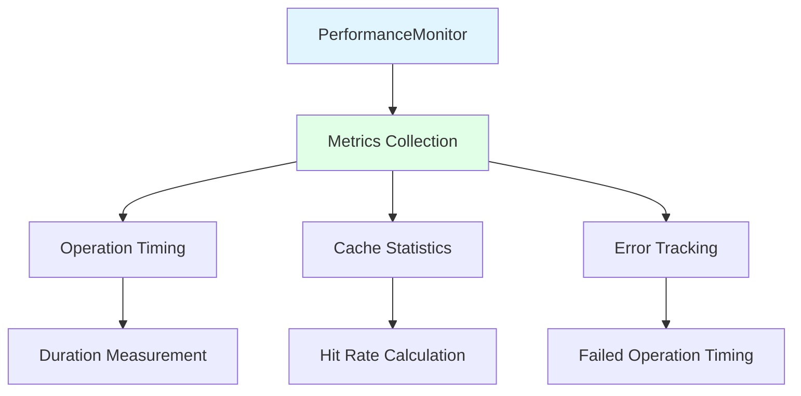

## Overview

The performance layer provides comprehensive monitoring and metrics collection for the documentation generation process. It tracks execution times, measures cache effectiveness, and provides detailed performance insights for optimization.

<Info>
  **Primary Component**: `src/performance/PerformanceMonitor.ts`
</Info>

## Key Responsibilities

<CardGroup cols={2}>
  <Card title="Execution Time Tracking" icon="clock">
    Measures duration of operations with high precision
  </Card>
  <Card title="Cache Hit Rate Monitoring" icon="bullseye">
    Tracks effectiveness of caching layers
  </Card>
  <Card title="Statistics Collection" icon="chart-bar">
    Aggregates performance metrics across operations
  </Card>
  <Card title="Performance Reporting" icon="file-chart">
    Generates detailed performance summaries
  </Card>
</CardGroup>

## Architecture

<Frame>

</Frame>

## Core Components

### PerformanceMonitor Class

<Accordion title="Metrics Collection" icon="database">
Stores detailed performance metrics:

```typescript
export interface PerformanceMetrics {
  operation: string;
  duration: number;
  timestamp: Date;
  metadata?: Record<string, unknown>;
}
```

**Features**:
- High-resolution timing using `performance.now()`
- Metadata attachment for context
- Error-aware timing (includes failed operations)
- Timestamp tracking for analysis
</Accordion>

<Accordion title="Operation Measurement" icon="stopwatch">
Measures both synchronous and asynchronous operations:

```typescript
// Synchronous measurement
public measure<T>(
  operation: string,
  fn: () => T,
  metadata?: Record<string, unknown>
): T

// Asynchronous measurement
public async measureAsync<T>(
  operation: string,
  fn: () => Promise<T>,
  metadata?: Record<string, unknown>
): Promise<T>
```

**Usage Example**:
```typescript
const result = performanceMonitor.measure('Type Analysis', () => {
  return analyzeComplexType(typeString);
}, { type: typeString, complexity: 'high' });
```
</Accordion>

<Accordion title="Statistics Generation" icon="chart-line">
Generates comprehensive operation statistics:

```typescript
public getOperationStats(operation: string): {
  count: number;
  totalDuration: number;
  averageDuration: number;
  minDuration: number;
  maxDuration: number;
}
```

**Calculations**:
- **Count**: Total number of operation executions
- **Total Duration**: Sum of all execution times
- **Average Duration**: Mean execution time
- **Min/Max Duration**: Range of execution times
</Accordion>

## Integration with Documentation Generation

<Steps>
  <Step title="Global Instance Management">
    Provides global performance monitor instance:

    ```typescript
    let globalPerformanceMonitor: PerformanceMonitor | null = null;

    export function getGlobalPerformanceMonitor(enabled: boolean = true): PerformanceMonitor {
      if (!globalPerformanceMonitor) {
        globalPerformanceMonitor = new PerformanceMonitor(enabled);
      }
      return globalPerformanceMonitor;
    }
    ```
  </Step>

  <Step title="MarkdownDocumenter Integration">
    Integrated into the main generation workflow:

    ```typescript
    // Initialize performance monitoring
    const performanceMonitor = getGlobalPerformanceMonitor(true);

    // Measure overall generation
    performanceMonitor.measure('Documentation Generation', () => {
      console.log();
      this._deleteOldOutputFiles();
      this._copyMintlifyComponents();
      this._writeApiItemPage(this._apiModel);

      // Generate navigation after all pages are written
      const navigationConfig = this._navigationManager.getStats();
      if (navigationConfig.totalItems > 0) {
        this.generateNavigation();
      }
    });

    // Print performance statistics
    performanceMonitor.printSummary();
    ```
  </Step>

  <Step title="Cache Integration">
    Works with CacheManager for comprehensive reporting:

    ```typescript
    // Print performance statistics
    performanceMonitor.printSummary();

    // Print cache statistics
    cacheManager.printStats();
    ```
  </Step>
</Steps>

## Performance Metrics

### Operation-Level Tracking

<CodeGroup>

```typescript Individual Operations
// Track specific operations
performanceMonitor.measure('Type Analysis', () => {
  return analyzeComplexType(typeString);
});

performanceMonitor.measure('API Resolution', () => {
  return resolveDeclarationReference(ref, context);
});

performanceMonitor.measure('MDX Emission', () => {
  return markdownEmitter.emit(output, context);
});
```

```typescript Batch Operations
// Track batch operations
performanceMonitor.measure('File Generation', () => {
  for (const apiItem of apiItems) {
    this._writeApiItemPage(apiItem);
  }
}, { itemCount: apiItems.length });
```

</CodeGroup>

### Statistics Collection

<Accordion title="Operation Statistics" icon="chart-bar">
Detailed statistics for each operation type:

```typescript
const stats = performanceMonitor.getOperationStats('Type Analysis');
console.log(`Type Analysis Statistics:`);
console.log(`  Count: ${stats.count}`);
console.log(`  Total: ${stats.totalDuration.toFixed(2)}ms`);
console.log(`  Average: ${stats.averageDuration.toFixed(2)}ms`);
console.log(`  Range: ${stats.minDuration.toFixed(2)}ms - ${stats.maxDuration.toFixed(2)}ms`);
```

**Example Output**:
```
Type Analysis Statistics:
  Count: 150
  Total: 2345.67ms
  Average: 15.64ms
  Range: 2.34ms - 145.23ms
```
</Accordion>

<Accordion title="Performance Summary" icon="file-chart">
Comprehensive performance report:

```typescript
public printSummary(): void {
  if (!this._enabled || this._metrics.length === 0) {
    return;
  }

  console.log('\n📊 Performance Summary:');

  // Group by operation
  const operations = new Set(this._metrics.map(m => m.operation));

  for (const operation of operations) {
    const stats = this.getOperationStats(operation);
    console.log(`   ${operation}:`);
    console.log(`     Count: ${stats.count}`);
    console.log(`     Total: ${stats.totalDuration.toFixed(2)}ms`);
    console.log(`     Average: ${stats.averageDuration.toFixed(2)}ms`);
    if (stats.count > 1) {
      console.log(`     Range: ${stats.minDuration.toFixed(2)}ms - ${stats.maxDuration.toFixed(2)}ms`);
    }
  }
}
```

**Example Output**:
```
📊 Performance Summary:
   Documentation Generation:
     Count: 1
     Total: 5234.56ms
     Average: 5234.56ms
   Type Analysis:
     Count: 150
     Total: 2345.67ms
     Average: 15.64ms
     Range: 2.34ms - 145.23ms
   API Resolution:
     Count: 89
     Total: 456.78ms
     Average: 5.13ms
     Range: 1.23ms - 34.56ms
```
</Accordion>

## Performance Characteristics

<CardGroup cols={3}>
  <Card title="Timing Precision" icon="crosshairs">
    **High Resolution**: Uses `performance.now()` for microsecond precision

    **Accuracy**: < 1ms accuracy for most operations

    **Overhead**: Minimal performance impact (< 0.1ms per measurement)
  </Card>

  <Card title="Memory Efficiency" icon="memory">
    **Lightweight Storage**: Stores only essential metrics data

    **Scalable**: Handles thousands of operations efficiently

    **Configurable**: Can be disabled entirely for zero overhead
  </Card>

  <Card title="Real-time Monitoring" icon="gauge">
    **Live Tracking**: Measures operations as they occur

    **Immediate Feedback**: Statistics available during generation

    **Error Awareness**: Tracks failed operations with timing
  </Card>
</CardGroup>

## Configuration Options

<Accordion title="Enable/Disable Monitoring" icon="toggle-on">
Control monitoring behavior:

```typescript
// Enable monitoring
const monitor = new PerformanceMonitor(true);

// Disable monitoring (zero overhead)
const monitor = new PerformanceMonitor(false);

// Check if enabled
if (monitor.isEnabled()) {
  // Performance-sensitive operations
}
```

**Use Cases**:
- **Development**: Always enabled for debugging
- **Production**: Optional, based on needs
- **Testing**: Disabled for consistent benchmarks
</Accordion>

<Accordion title="Metadata Attachment" icon="tags">
Add contextual information to measurements:

```typescript
performanceMonitor.measure('Type Analysis', () => {
  return analyzeComplexType(typeString);
}, {
  type: typeString,
  complexity: getComplexityScore(typeString),
  sourceFile: currentFile,
  lineNumber: currentLine
});
```

**Benefits**:
- Enhanced debugging information
- Performance correlation analysis
- Identifying problematic patterns
</Accordion>

## Advanced Usage

<Accordion title="Custom Performance Analysis" icon="chart-area">
Extract and analyze performance data:

```typescript
// Get all metrics
const allMetrics = performanceMonitor.getMetrics();

// Get metrics for specific operation
const typeAnalysisMetrics = performanceMonitor.getMetricsForOperation('Type Analysis');

// Analyze trends
const recentMetrics = allMetrics.filter(m =>
  m.timestamp > new Date(Date.now() - 60000) // Last minute
);

// Calculate custom statistics
const slowOperations = typeAnalysisMetrics.filter(m => m.duration > 50);
const errorOperations = typeAnalysisMetrics.filter(m => m.metadata?.error);
```
</Accordion>

<Accordion title="Performance Optimization" icon="rocket">
Use metrics to optimize performance:

```typescript
// Identify bottlenecks
const stats = performanceMonitor.getOperationStats('Type Analysis');
if (stats.averageDuration > 20) {
  console.warn('Type analysis is slow, consider optimization');
}

// Compare optimization attempts
const beforeOptimization = performanceMonitor.getOperationStats('Type Analysis');
// Apply optimization...
const afterOptimization = performanceMonitor.getOperationStats('Type Analysis');

console.log(`Improvement: ${
  ((beforeOptimization.averageDuration - afterOptimization.averageDuration) /
   beforeOptimization.averageDuration * 100).toFixed(1)
}%`);
```
</Accordion>

## Integration with Caching

<Accordion title="Cache Performance Monitoring" icon="database">
Performance monitor works alongside cache statistics:

```typescript
// Complete performance picture
console.log('\n📊 Performance Summary:');
performanceMonitor.printSummary();

cacheManager.printStats();

// Correlate cache hits with performance
const typeAnalysisStats = performanceMonitor.getOperationStats('Type Analysis');
const cacheStats = cacheManager.typeAnalysis.getStats();

console.log(`Cache hit rate: ${(cacheStats.hitRate * 100).toFixed(1)}%`);
console.log(`Average type analysis time: ${typeAnalysisStats.averageDuration.toFixed(2)}ms`);
```

**Analysis**:
- High hit rate + fast operations = Good cache effectiveness
- Low hit rate + slow operations = Cache needs tuning
- High hit rate + slow operations = Cache working, but operations need optimization
</Accordion>

## Best Practices

<AccordionGroup>
  <Accordion title="Development Guidelines" icon="code">
**Always Monitor During Development**:
- Enable performance monitoring
- Review operation statistics
- Identify performance bottlenecks

**Use Descriptive Operation Names**:
```typescript
// Good
performanceMonitor.measure('Complex Type Analysis', () => { ... });

// Avoid
performanceMonitor.measure('Operation', () => { ... });
```

**Include Relevant Metadata**:
```typescript
performanceMonitor.measure('API Resolution', () => { ... }, {
  declarationReference: ref.toString(),
  contextItem: contextItem?.displayName,
  resolutionType: 'link'
});
```
  </Accordion>

  <Accordion title="Production Considerations" icon="server">
**Optional Monitoring**:
- Make monitoring configurable
- Consider performance overhead
- Log summaries for analysis

**Resource Management**:
```typescript
// Clear metrics between generations
performanceMonitor.clear();

// Reset global instance if needed
resetGlobalPerformanceMonitor();
```

**Performance Budgets**:
- Set acceptable performance thresholds
- Monitor for regressions
- Alert on significant changes
  </Accordion>

  <Accordion title="Testing Strategies" icon="vial">
**Consistent Benchmarks**:
- Disable monitoring during unit tests
- Use consistent test data
- Control for environmental factors

**Performance Regression Testing**:
```typescript
const baselineStats = performanceMonitor.getOperationStats('Type Analysis');
// Run optimized code
const newStats = performanceMonitor.getOperationStats('Type Analysis');

assert(newStats.averageDuration <= baselineStats.averageDuration * 1.1,
  'Performance regression detected');
```
  </Accordion>
</AccordionGroup>

## Troubleshooting

<AccordionGroup>
  <Accordion title="Missing Metrics" icon="search">
**Symptoms**: No performance data collected

**Causes**:
- Performance monitoring disabled
- Operations not wrapped with measurement
- Metrics cleared prematurely

**Solutions**:
```typescript
// Verify monitoring is enabled
console.log('Monitoring enabled:', performanceMonitor.isEnabled());

// Check for metrics
const metrics = performanceMonitor.getMetrics();
console.log('Metrics count:', metrics.length);

// Ensure operations are measured
const result = performanceMonitor.measure('My Operation', () => {
  return performOperation();
});
```
  </Accordion>

  <Accordion title="Inconsistent Timing" icon="clock">
**Symptoms**: Variable timing results for same operations

**Causes**:
- Environmental factors (CPU load, other processes)
- Garbage collection pauses
- I/O operation variance

**Solutions**:
- Run multiple iterations and average
- Control test environment
- Use statistical analysis
- Consider warm-up runs
  </Accordion>

  <Accordion title="Memory Accumulation" icon="memory">
**Symptoms**: Memory usage grows over time

**Causes**:
- Metrics not cleared between runs
- Global instance retaining data
- Memory leaks in measurement

**Solutions**:
```typescript
// Clear metrics regularly
performanceMonitor.clear();

// Reset global instance
resetGlobalPerformanceMonitor();

// Monitor memory usage
const memoryUsage = process.memoryUsage();
console.log('Memory usage:', memoryUsage);
```
  </Accordion>
</AccordionGroup>

## Related Documentation

<CardGroup cols={2}>
  <Card title="Caching Layer" icon="database" href="/architecture/caching-layer">
    Learn about performance optimization through caching
  </Card>
  <Card title="Generation Layer" icon="cogs" href="/architecture/generation-layer">
    See performance monitoring in document generation
  </Card>
  <Card title="Emission Layer" icon="file-export" href="/architecture/emission-layer">
    View performance tracking in MDX emission
  </Card>
  <Card title="Utilities Layer" icon="wrench" href="/architecture/utils-layer">
    Discover performance-optimized utilities
  </Card>
</CardGroup>