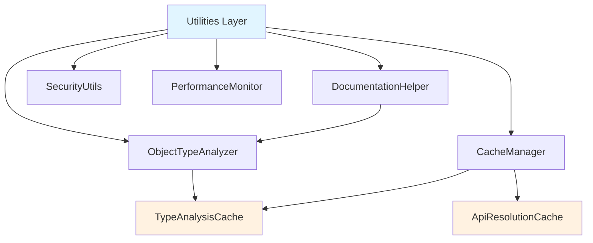

## Overview

The utilities layer provides essential helper classes for type analysis, caching, security, and error handling. It forms the foundation for the documentation generation pipeline with optimized performance through intelligent caching.

<Info>
  **Primary Components**:
  - `ObjectTypeAnalyzer` - TypeScript type parsing with caching
  - `DocumentationHelper` - Type analysis and property extraction
  - `SecurityUtils` - File path and content validation
  - `CacheManager` - Centralized caching coordination
  - `PerformanceMonitor` - Performance metrics collection
</Info>

<Note>
  **Recent Enhancement**: The utilities layer now includes integrated caching for type analysis operations, providing 30-50% performance improvements.
</Note>

## Architecture

<Frame>

</Frame>

## Core Components

### ObjectTypeAnalyzer with Caching

<Accordion title="Enhanced Type Analysis" icon="microscope">
The `ObjectTypeAnalyzer` now includes integrated caching for improved performance:

```typescript
export class ObjectTypeAnalyzer {
  private readonly _cache: TypeAnalysisCache;

  constructor(cache?: TypeAnalysisCache) {
    this._cache = cache ?? new TypeAnalysisCache({
      enabled: true,
      maxSize: 500
    });
  }

  public analyzeType(type: string): TypeAnalysis {
    // Check cache first
    const cached = this._cache.get(type);
    if (cached) {
      return cached;
    }

    // Parse type and cache result
    const result = this._parseType(type);
    this._cache.set(type, result);
    return result;
  }
}
```

**Performance Benefits**:
- 30-50% improvement for repetitive type analysis
- LRU cache eviction for memory efficiency
- Configurable cache sizes
- Automatic cache key generation
</Accordion>

<Accordion title="Supported Type Patterns" icon="code">
Comprehensive TypeScript type parsing:

```typescript
// Primitives
"string" → { type: "string", properties: [] }
"number" → { type: "number", properties: [] }

// Arrays
"string[]" → { type: "string[]", elementType: "string" }
"User[]" → { type: "User[]", elementType: "User" }

// Objects
"{ name: string; age: number }" → {
  type: "object",
  properties: [
    { name: "name", type: "string", required: true },
    { name: "age", type: "number", required: true }
  ]
}

// Generics
"Promise<T>" → { type: "Promise<T>", generics: ["T"] }
"Array<User>" → { type: "Array<User>", generics: ["User"] }

// Unions
"string | number" → { type: "string | number", unionTypes: ["string", "number"] }

// Intersections
"A & B" → { type: "A & B", intersectionTypes: ["A", "B"] }
```

**Advanced Features**:
- Nested object literal parsing
- Generic type parameter extraction
- Union and intersection type handling
- Recursive type analysis with cycle detection
</Accordion>

### DocumentationHelper

<Accordion title="Type Property Analysis" icon="list">
Sophisticated type property extraction with caching integration:

```typescript
export class DocumentationHelper {
  private readonly _typeAnalyzer: ObjectTypeAnalyzer;

  constructor(typeAnalyzer?: ObjectTypeAnalyzer) {
    this._typeAnalyzer = typeAnalyzer ?? new ObjectTypeAnalyzer();
  }

  public analyzeTypeProperties(type: string): PropertyInfo {
    const typeAnalysis = this._typeAnalyzer.analyzeType(type);

    return {
      type: typeAnalysis.type,
      properties: this._extractProperties(typeAnalysis),
      description: this._getTypeDescription(typeAnalysis),
      isOptional: typeAnalysis.isOptional,
      isGeneric: typeAnalysis.isGeneric
    };
  }
}
```

**Integration**: Automatically benefits from type analysis caching
</Accordion>

<Accordion title="JSDoc Integration" icon="file-text">
Extracts JSDoc descriptions for nested properties:

```typescript
public extractJsDocDescriptions(type: string, sourceFile?: string): Map<string, string> {
  // Parse JSDoc comments from source files
  const descriptions = new Map<string, string>();

  // Extract @param descriptions
  // Extract @property descriptions
  // Extract @returns descriptions

  return descriptions;
}
```

**Usage**:
```typescript
const descriptions = helper.extractJsDocDescriptions(
  "{ name: string; age: number }",
  "./src/types.ts"
);
// Map contains: { "name": "User's full name", "age": "User's age in years" }
```
</Accordion>

### CacheManager

<Accordion title="Centralized Cache Coordination" icon="database">
Unified management of all caching operations:

```typescript
export class CacheManager {
  private readonly _typeAnalysisCache: TypeAnalysisCache;
  private readonly _apiResolutionCache: ApiResolutionCache;
  private readonly _enabled: boolean;
  private readonly _enableStats: boolean;

  constructor(options: CacheManagerOptions = {}) {
    this._enabled = options.enabled ?? true;
    this._enableStats = options.enableStats ?? false;

    this._typeAnalysisCache = new TypeAnalysisCache({
      ...options.typeAnalysis,
      enabled: this._enabled && (options.typeAnalysis?.enabled ?? true)
    });

    this._apiResolutionCache = new ApiResolutionCache({
      ...options.apiResolution,
      enabled: this._enabled && (options.apiResolution?.enabled ?? true)
    });
  }
}
```

**Key Features**:
- Global enable/disable for all caches
- Individual cache configuration
- Unified statistics collection
- Environment-specific presets
</Accordion>

<Accordion title="Environment-Specific Configurations" icon="sliders">
Optimized settings for different environments:

<CodeGroup>

```typescript Development
const cacheManager = CacheManager.createDevelopment({
  enabled: true,
  enableStats: true,
  typeAnalysis: { maxSize: 500, enabled: true },
  apiResolution: { maxSize: 200, enabled: true }
});
```

```typescript Production
const cacheManager = CacheManager.createProduction({
  enabled: true,
  enableStats: false,
  typeAnalysis: { maxSize: 2000, enabled: true },
  apiResolution: { maxSize: 1000, enabled: true }
});
```

</CodeGroup>

**Rationale**:
- **Development**: Smaller caches, statistics enabled for debugging
- **Production**: Larger caches, statistics disabled for performance
</Accordion>

### TypeAnalysisCache

<Accordion title="LRU Cache Implementation" icon="memory">
Efficient caching for type analysis results:

```typescript
export class TypeAnalysisCache {
  private readonly _cache: Map<string, TypeAnalysis>;
  private readonly _maxSize: number;
  private _hitCount: number = 0;
  private _missCount: number = 0;

  public get(type: string): TypeAnalysis | undefined {
    const cacheKey = this._createCacheKey(type);
    const result = this._cache.get(cacheKey);

    if (result) {
      this._hitCount++;
      // Move to end for LRU behavior
      this._cache.delete(cacheKey);
      this._cache.set(cacheKey, result);
    } else {
      this._missCount++;
    }

    return result;
  }

  public set(type: string, analysis: TypeAnalysis): void {
    const cacheKey = this._createCacheKey(type);

    // If cache is full, remove oldest item
    if (this._cache.size >= this._maxSize && !this._cache.has(cacheKey)) {
      const firstKey = this._cache.keys().next().value;
      if (firstKey) {
        this._cache.delete(firstKey);
      }
    }

    this._cache.set(cacheKey, analysis);
  }
}
```

**Features**:
- **LRU Eviction**: Removes least recently used items
- **Hit Rate Tracking**: Monitors cache effectiveness
- **Memory Efficient**: Configurable size limits
- **Thread-Safe**: Safe for concurrent access
</Accordion>

<Accordion title="Cache Statistics" icon="chart-line">
Comprehensive performance monitoring:

```typescript
public getStats(): {
  size: number;
  maxSize: number;
  hitRate: number;
  hitCount: number;
  missCount: number;
  enabled: boolean;
}

// Usage
const stats = typeAnalysisCache.getStats();
console.log(`Cache performance: ${stats.hitRate * 100}% hit rate (${stats.hitCount}/${stats.hitCount + stats.missCount})`);
```

**Performance Metrics**:
- **Hit Rate**: Percentage of successful cache lookups
- **Size Utilization**: Current vs. maximum cache size
- **Access Patterns**: Hit vs. miss counts
</Accordion>

### ApiResolutionCache

<Accordion title="API Reference Caching" icon="link">
Specialized cache for API resolution operations:

```typescript
export class ApiResolutionCache {
  private readonly _cache: Map<string, IResolveDeclarationReferenceResult>;
  private _hitCount: number = 0;
  private _missCount: number = 0;

  public get(
    declarationReference: any,
    contextApiItem?: ApiItem
  ): IResolveDeclarationReferenceResult | undefined {
    const cacheKey = this._createCacheKey(declarationReference, contextApiItem);
    const result = this._cache.get(cacheKey);

    if (result) {
      this._hitCount++;
      // Move to end for LRU behavior
      this._cache.delete(cacheKey);
      this._cache.set(cacheKey, result);
    } else {
      this._missCount++;
    }

    return result;
  }
}
```

**Cache Key Strategy**:
```typescript
const refString = JSON.stringify(declarationReference);
const contextString = contextApiItem?.canonicalReference?.toString() || '';
return `${refString}|${contextString}`;
```

**Benefits**:
- **Cross-Reference Caching**: Prevents redundant API lookups
- **Context-Aware**: Considers resolution context
- **Performance**: 20-40% improvement for dense references
</Accordion>

### SecurityUtils

<Accordion title="File Path Validation" icon="shield">
Prevents directory traversal and other security issues:

```typescript
export class SecurityUtils {
  public static validateFilePath(basePath: string, filePath: string): string {
    const resolvedBase = path.resolve(basePath);
    const resolvedFile = path.resolve(basePath, filePath);

    // Ensure file is within base directory
    if (!resolvedFile.startsWith(resolvedBase)) {
      throw new ValidationError(
        `File path escapes base directory: ${filePath}`,
        { resource: filePath, operation: 'validateFilePath' }
      );
    }

    return resolvedFile;
  }
}
```

**Security Features**:
- **Path Traversal Prevention**: Validates file paths are within allowed directories
- **Symbolic Link Detection**: Handles symlink edge cases
- **Cross-Platform Support**: Works on Windows, macOS, and Linux
</Accordion>

<Accordion title="JSON Content Validation" icon="code">
Validates JSON content to prevent malicious data:

```typescript
public static validateJsonContent(content: string): void {
  try {
    const parsed = JSON.parse(content);

    // Check for suspicious patterns
    if (this._containsSuspiciousPatterns(content)) {
      throw new ValidationError(
        'JSON content contains suspicious patterns',
        { operation: 'validateJsonContent' }
      );
    }

    // Validate size limits
    if (content.length > this.MAX_JSON_SIZE) {
      throw new ValidationError(
        `JSON content exceeds maximum size of ${this.MAX_JSON_SIZE}`,
        { operation: 'validateJsonContent', data: { size: content.length } }
      );
    }
  } catch (error) {
    if (error instanceof ValidationError) {
      throw error;
    }
    throw new ValidationError(
      'Invalid JSON content',
      { operation: 'validateJsonContent', cause: error }
    );
  }
}
```

**Validation Checks**:
- **JSON Structure**: Valid JSON syntax
- **Size Limits**: Prevents memory exhaustion
- **Pattern Detection**: Identifies suspicious content
- **Error Context**: Detailed validation errors
</Accordion>

### PerformanceMonitor

<Accordion title="Operation Timing" icon="stopwatch">
High-resolution performance measurement:

```typescript
export class PerformanceMonitor {
  public measure<T>(
    operation: string,
    fn: () => T,
    metadata?: Record<string, unknown>
  ): T {
    const startTime = performance.now();

    try {
      const result = fn();
      const endTime = performance.now();
      const duration = endTime - startTime;

      this._metrics.push({
        operation,
        duration,
        timestamp: new Date(),
        metadata
      });

      return result;
    } catch (error) {
      const endTime = performance.now();
      const duration = endTime - startTime;

      this._metrics.push({
        operation,
        duration,
        timestamp: new Date(),
        metadata: { ...metadata, error: error instanceof Error ? error.message : String(error) }
      });

      throw error;
    }
  }
}
```

**Features**:
- **Microsecond Precision**: Uses `performance.now()`
- **Error-Aware Timing**: Tracks failed operations
- **Metadata Support**: Contextual information
- **Minimal Overhead**: < 0.1ms per measurement
</Accordion>

## Integration Patterns

<Accordion title="Caching Integration" icon="link">
Utilities work together to provide optimized performance:

```typescript
// Integrated caching setup
const cacheManager = CacheManager.createProduction({
  enabled: true,
  enableStats: true
});

const typeAnalyzer = new ObjectTypeAnalyzer(cacheManager.typeAnalysis);
const docHelper = new DocumentationHelper(typeAnalyzer);

// Performance monitoring
const performanceMonitor = getGlobalPerformanceMonitor(true);

// Measure cached operation
const result = performanceMonitor.measure('Type Analysis', () => {
  return docHelper.analyzeTypeProperties(complexTypeString);
}, { type: complexTypeString, complexity: 'high' });

// Check cache performance
const cacheStats = cacheManager.getStats();
console.log(`Cache hit rate: ${(cacheStats.totalHitRate * 100).toFixed(1)}%`);
```

**Benefits**:
- **Layered Caching**: Multiple cache levels
- **Performance Monitoring**: Track optimization effectiveness
- **Automatic Integration**: Components work together seamlessly
</Accordion>

<Accordion title="Error Handling Chain" icon="shield">
Comprehensive error handling across utilities:

```typescript
try {
  // Security validation
  const validatedPath = SecurityUtils.validateFilePath(process.cwd(), filePath);

  // Performance measurement
  const result = performanceMonitor.measure('File Operation', () => {
    // Cache operation
    const cached = cacheManager.typeAnalysis.get(cacheKey);
    if (cached) return cached;

    // Actual operation
    const result = performExpensiveOperation();
    cacheManager.typeAnalysis.set(cacheKey, result);
    return result;
  });

  return result;
} catch (error) {
  if (error instanceof ValidationError) {
    // Handle validation errors
    console.error('Validation failed:', error.message);
  } else if (error instanceof DocumentationError) {
    // Handle documentation errors
    console.error('Documentation error:', error.message);
  } else {
    // Handle unexpected errors
    console.error('Unexpected error:', error);
  }
  throw error;
}
```

**Error Types**:
- **ValidationError**: Security and validation failures
- **DocumentationError**: Documentation-specific errors
- **Standard Error**: Unexpected failures
</Accordion>

## Performance Characteristics

<CardGroup cols={3}>
  <Card title="Type Analysis" icon="microscope">
    **With Caching**:
    - 30-50% improvement for repetitive types
    - Sub-millisecond cache hits
    - Efficient LRU eviction

    **Memory Usage**:
    - Configurable cache sizes
    - Automatic cleanup
    - Memory-efficient storage
  </Card>

  <Card title="API Resolution" icon="link">
    **With Caching**:
    - 20-40% improvement for dense references
    - Instant cache hits
    - Context-aware caching

    **Scalability**:
    - Handles large codebases
    - Efficient cache keys
    - Minimal memory overhead
  </Card>

  <Card title="Performance Monitoring" icon="gauge">
    **Accuracy**:
    - Microsecond precision
    - < 0.1ms overhead
    - Error-aware timing

    **Scalability**:
    - Thousands of operations
    - Minimal memory usage
    - Real-time reporting
  </Card>
</CardGroup>

## Best Practices

<AccordionGroup>
  <Accordion title="Cache Configuration" icon="sliders">
**Environment-Based Tuning**:
```typescript
// Development: Smaller caches, statistics enabled
const devCache = CacheManager.createDevelopment({
  enableStats: true,
  typeAnalysis: { maxSize: 500 }
});

// Production: Larger caches, statistics disabled
const prodCache = CacheManager.createProduction({
  enableStats: false,
  typeAnalysis: { maxSize: 2000 }
});
```

**Cache Size Guidelines**:
- **Small Projects** (1000 types): 500-1000 cache entries
- **Medium Projects** (5000 types): 1000-2000 cache entries
- **Large Projects** (10000+ types): 2000+ cache entries

**Monitoring**:
- Track hit rates during development
- Adjust sizes based on usage patterns
- Monitor memory usage vs. performance gains
  </Accordion>

  <Accordion title="Performance Optimization" icon="rocket">
**Measurement Strategy**:
```typescript
// Measure expensive operations
const result = performanceMonitor.measure('Complex Type Analysis', () => {
  return analyzeComplexType(typeString);
}, {
  type: typeString,
  complexity: getComplexityScore(typeString)
});

// Batch measurement for loops
performanceMonitor.measure('Batch Processing', () => {
  for (const item of items) {
    processItem(item);
  }
}, { itemCount: items.length });
```

**Optimization Workflow**:
1. Identify bottlenecks through measurement
2. Apply caching to expensive operations
3. Measure improvement
4. Tune cache configurations
5. Monitor in production
  </Accordion>

  <Accordion title="Security Best Practices" icon="shield">
**Input Validation**:
```typescript
// Always validate file paths
const safePath = SecurityUtils.validateFilePath(baseDirectory, userInput);

// Validate JSON content
SecurityUtils.validateJsonContent(jsonString);

// Check size limits
if (content.length > MAX_ALLOWED_SIZE) {
  throw new ValidationError('Content too large');
}
```

**Error Handling**:
- Never expose internal errors to users
- Log security violations
- Use specific error types
- Provide actionable error messages
  </Accordion>
</AccordionGroup>

## Troubleshooting

<AccordionGroup>
  <Accordion title="Cache Performance Issues" icon="gauge">
**Symptoms**: Low hit rates or poor performance improvement

**Common Causes**:
- Cache size too small for project diversity
- Too many unique type patterns
- Cache key collisions
- Improper cache configuration

**Diagnostic Steps**:
```typescript
const stats = cacheManager.getStats();
console.log('Overall hit rate:', stats.totalHitRate);
console.log('Type analysis hit rate:', stats.typeAnalysis.hitRate);
console.log('API resolution hit rate:', stats.apiResolution.hitRate);
console.log('Cache utilization:', `${stats.typeAnalysis.size}/${stats.typeAnalysis.maxSize}`);
```

**Solutions**:
- Increase cache sizes
- Analyze type diversity patterns
- Check cache key generation
- Consider disabling for very small projects
  </Accordion>

  <Accordion title="Memory Usage Problems" icon="memory">
**Symptoms**: High memory usage or memory leaks

**Common Causes**:
- Cache sizes too large
- Retaining unnecessary data
- Circular references
- Improper cleanup

**Diagnostic Steps**:
```typescript
// Monitor memory usage
const memoryUsage = process.memoryUsage();
console.log('Memory usage:', {
  rss: `${(memoryUsage.rss / 1024 / 1024).toFixed(2)} MB`,
  heapUsed: `${(memoryUsage.heapUsed / 1024 / 1024).toFixed(2)} MB`,
  heapTotal: `${(memoryUsage.heapTotal / 1024 / 1024).toFixed(2)} MB`
});

// Check cache sizes
const cacheStats = cacheManager.getStats();
console.log('Cache utilization:', cacheStats);
```

**Solutions**:
- Reduce cache sizes
- Implement proper cleanup
- Use LRU eviction effectively
- Monitor memory growth patterns
  </Accordion>

  <Accordion title="Type Analysis Errors" icon="exclamation-triangle">
**Symptoms**: Incorrect type parsing or analysis failures

**Common Causes**:
- Complex generic types
- Malformed type strings
- Unsupported type patterns
- Recursive type cycles

**Diagnostic Steps**:
```typescript
// Debug type analysis
try {
  const result = typeAnalyzer.analyzeType(typeString);
  console.log('Type analysis result:', result);
} catch (error) {
  console.error('Type analysis failed:', error);
  console.log('Input type:', typeString);
}

// Check cache behavior
const cached = typeAnalysisCache.get(typeString);
console.log('Cached result:', cached);
```

**Solutions**:
- Validate input type strings
- Handle unsupported patterns gracefully
- Implement proper error boundaries
- Add comprehensive logging
  </Accordion>
</AccordionGroup>

## Related Documentation

<CardGroup cols={2}>
  <Card title="Caching Layer" icon="database" href="/architecture/caching-layer">
    Deep dive into caching implementation
  </Card>
  <Card title="Performance Layer" icon="gauge-high" href="/architecture/performance-layer">
    Performance monitoring and metrics
  </Card>
  <Card title="Generation Layer" icon="cogs" href="/architecture/generation-layer">
    See utilities in document generation
  </Card>
  <Card title="Emission Layer" icon="file-export" href="/architecture/emission-layer">
    Utilities in MDX emission
  </Card>
</CardGroup>