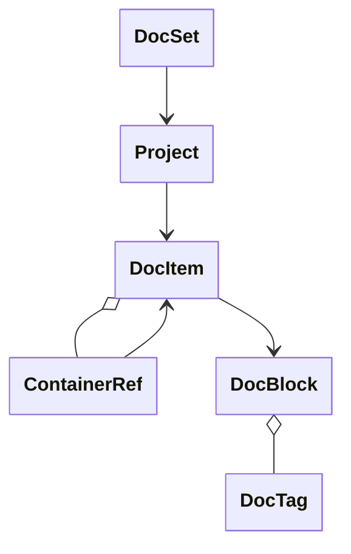

## Overview

OpenDocs provides a unified model that transforms documentation from any programming language into a consistent, navigable structure. Instead of maintaining separate models for TypeScript, Rust, Go, Python, and other languages, OpenDocs defines five core components that work together to represent documentation universally:

- **DocSet** - The root object in `opendocs.json` containing metadata and projects
- **Project** - Individual project in a monorepo (package, library, app)
- **DocItem** - Universal element representing any documentable code (classes, functions, methods, etc.)
- **DocBlock** - Structured documentation content extracted from code comments
- **DocTag** - Individual documentation tags (`@param`, `@returns`, `@deprecated`)

This approach eliminates complexity while providing complete flexibility for language-specific features.

import { TypeTree, TypeTreeGroup } from "/snippets/tsdocs/TypeTree.jsx"
import { JsonTree } from "/snippets/tsdocs/JsonTree.jsx"

## Model Hierarchy

The five models form a hierarchical structure where each plays a specific role:



**Data Flow:**
1. **DocSet** (the `opendocs.json` file) contains metadata and an array of Projects
2. **Projects** contain top-level DocItems (packages, modules, namespaces)
3. **DocItems** nest hierarchically through the `items` array
4. Each **DocItem** references its parent container via **ContainerRef**
5. **DocItems** link to their documentation via **DocBlock**
6. **DocBlocks** organize tags in arrays for structured metadata

## The Five Core Models

### DocSet

The DocSet model represents the `opendocs.json` file - the entry point for your Documentation Set. This is the root object that contains metadata about the documentation and references all projects.

export const docSetType = {
  name: "DocSet",
  type: "object",
  description: "Root object in opendocs.json file",
  required: true,
  properties: [
    {
      name: "id",
      type: "string",
      description: "Documentation set identifier",
      required: true
    },
    {
      name: "name",
      type: "string",
      description: "Human-readable documentation name",
      required: true
    },
    {
      name: "description",
      type: "string",
      description: "Optional description of the documentation"
    },
    {
      name: "version",
      type: "string",
      description: "OpenDocs specification version"
    },
    {
      name: "projects",
      type: "Project[]",
      description: "Array of projects in this documentation set",
      required: true
    },
    {
      name: "metadata",
      type: "object",
      description: "Additional metadata (created, modified, etc.)"
    }
  ]
};

<TypeTree open {...docSetType} />

**Purpose:**
The DocSet model exists to:
- Provide a single entry point (`opendocs.json`) for the entire Documentation Set
- Store metadata about the documentation itself
- Organize multiple projects in monorepos
- Enable versioning and tracking of documentation changes

### Project

The Project model represents an individual project within a Documentation Set. In monorepos, each package, library, or app is a separate Project. Each Project has its own language, version, and contains all DocItems that make up that project's API reference.

export const projectType = {
  name: "Project",
  type: "object",
  description: "Root container for documentation project",
  required: true,
  properties: [
    {
      name: "id",
      type: "string",
      description: "Unique project identifier",
      required: true
    },
    {
      name: "name",
      type: "string",
      description: "Human-readable project name",
      required: true
    },
    {
      name: "language",
      type: "string",
      description: "Programming language (typescript, rust, go, python, etc.)",
      required: true
    },
    {
      name: "description",
      type: "string",
      description: "Project description"
    },
    {
      name: "version",
      type: "string",
      description: "Project version"
    },
    {
      name: "items",
      type: "DocItem[]",
      description: "Top-level documentation items (modules, namespaces, packages)",
      required: true
    },
    {
      name: "dependencies",
      type: "string[]",
      description: "IDs of projects this project depends on"
    },
    {
      name: "metadata",
      type: "object",
      description: "Project-specific metadata"
    }
  ]
};

<TypeTree open {...projectType} />

**Key use case - Monorepos:**
The Project model was designed to support monorepos where a single Documentation Set contains multiple projects (packages, apps, libraries). Each project has its own identifier, language, and version while sharing a common documentation structure.

**Organizational patterns:**
- Use unique, descriptive IDs (e.g., `"auth-service"`, `"web-sdk"`)
- Specify the programming language for each project
- Organize top-level items logically (by module, package, or namespace)
- Use meaningful project names that match your package/repository
- Declare dependencies between projects for proper cross-referencing
- Include version information for documentation tracking

### DocItem

The DocItem is the fundamental unit of documentation in OpenDocs. **Everything is a DocItem** - from entire modules down to individual method parameters. This unified approach works across all programming languages while preserving language-specific characteristics.

export const docItemType = {
  name: "DocItem",
  type: "object",
  description: "Universal documentation element",
  required: true,
  properties: [
    {
      name: "id",
      type: "string",
      description: "Unique identifier for this item",
      required: true
    },
    {
      name: "name",
      type: "string",
      description: "Human-readable name",
      required: true
    },
    {
      name: "kind",
      type: "string",
      description: "Language-specific item type (\"class\", \"rust-trait\", \"go-receiver-method\")",
      required: true
    },
    {
      name: "language",
      type: "string",
      description: "Source language",
      required: true
    },
    {
      name: "docBlock",
      type: "DocBlock",
      description: "Documentation content"
    },
    {
      name: "container",
      type: "ContainerRef",
      description: "Container relationship (module, class, namespace, etc.)"
    },
    {
      name: "metadata",
      type: "object",
      description: "Language-specific metadata (includes signature info)"
    },
    {
      name: "items",
      type: "DocItem[]",
      description: "Child items (methods, properties, nested types)",
      properties: []
    }
  ]
};

<TypeTree open {...docItemType} />

**Universal abstraction:**
Every documentation element, regardless of programming language, is represented as a DocItem:

- **Rust:** `struct`, `trait`, `impl-method`
- **Go:** `struct`, `interface`, `receiver-method`
- **TypeScript:** `class`, `interface`, `method`, `property`
- **Python:** `class`, `function`, `property`

**Language-specific flexibility:**
The `kind` field enables complete language-specific typing without breaking the universal model:

```json
{
  "id": "serde::de::Deserialize",
  "name": "Deserialize",
  "kind": "trait",
  "language": "rust",
  "metadata": {
    "associatedTypes": ["Item"],
    "supertraits": ["Sized"]
  }
}
```

**Hierarchical nesting example:**
```json
{
  "id": "my-module",
  "name": "My Module",
  "kind": "module",
  "language": "typescript",
  "items": [
    {
      "id": "my-module#MyClass",
      "name": "MyClass",
      "kind": "class",
      "language": "typescript",
      "items": [
        {
          "id": "my-module#MyClass#constructor",
          "name": "constructor",
          "kind": "constructor",
          "language": "typescript"
        }
      ]
    }
  ]
}
```

### DocBlock

DocBlock represents structured documentation content extracted from source code comments. It provides a unified format for documentation regardless of the original comment syntax (TSDoc, Javadoc, rustdoc, etc.).

export const docBlockType = {
  name: "DocBlock",
  type: "object",
  description: "Documentation content structure",
  properties: [
    {
      name: "description",
      type: "string",
      description: "Main description text"
    },
    {
      name: "tags",
      type: "Record<string, (string | DocTag)[]>",
      description: "Documentation tags (@param, @returns, etc.)"
    },
    {
      name: "deprecated",
      type: "DeprecatedInfo",
      description: "Deprecation information",
      properties: [
        {
          name: "message",
          type: "string",
          description: "Deprecation message",
          required: true
        },
        {
          name: "since",
          type: "string",
          description: "Version when deprecated"
        }
      ]
    }
  ]
};

<TypeTree open {...docBlockType} />

**Tag structure:**
DocBlock organizes tags in a `Record<string, (string | DocTag)[]>` where each tag can be either a simple string or a complex DocTag object.

### DocTag

DocTag represents individual documentation tags. It supports both simple string values and complex parameter structures for tags like `@param`, `@returns`, and `@deprecated`.

export const docTagType = {
  name: "DocTag",
  type: "object",
  description: "Complex documentation tag with parameters",
  properties: [
    {
      name: "name",
      type: "string",
      description: "Tag name without @",
      required: true
    },
    {
      name: "content",
      type: "string",
      description: "Tag content",
      required: true
    },
    {
      name: "parameters",
      type: "Record<string, string>",
      description: "Tag parameters for complex tags (name, type, etc.)"
    }
  ]
};

<TypeTree open {...docTagType} />

**Two types of tags:**

Simple tags are just strings:
```json
{
  "tags": {
    "since": ["1.0.0"],
    "author": ["John Doe"]
  }
}
```

Complex tags include structured metadata:
```json
{
  "tags": {
    "param": [
      {
        "name": "param",
        "content": "The width of the rectangle",
        "parameters": { "name": "width", "type": "number" }
      }
    ]
  }
}
```

**Cross-format normalization:**

Different languages use different doc comment syntax, but all normalize to the same DocTag structure:

| Format | Syntax | Normalized To |
|--------|--------|---------------|
| **TSDoc** | `@param width - The width` | `{ name: "param", content: "The width", parameters: { name: "width" } }` |
| **Javadoc** | `@param width the width` | Same DocTag structure |
| **Python** | `:param width: The width`<br/>`:type width: int` | Same structure, with `type: "int"` in parameters |
| **Rustdoc** | `* \`width\` - The width` | Same DocTag structure |
| **XMLDoc** | `<param name="width">The width</param>` | Same DocTag structure |

This enables consistent rendering and cross-language documentation tools.

### ContainerRef

ContainerRef links DocItems to their parent containers, enabling proper navigation and context.

export const containerRefType = {
  name: "ContainerRef",
  type: "object",
  description: "Reference to a containing DocItem",
  properties: [
    {
      name: "id",
      type: "string",
      description: "ID of the containing DocItem",
      required: true
    },
    {
      name: "relationship",
      type: "\"module\" | \"class\" | \"interface\" | \"namespace\" | \"custom\"",
      description: "Type of containment relationship",
      required: true
    }
  ]
};

<TypeTree open {...containerRefType} />

## How Models Work Together

### Complete Hierarchy Example

```
Project: "My Project" (version: 1.0.0)
├── DocItem: Package "my-module" (module)
│   ├── DocItem: Class "Calculator"
│   │   ├── DocBlock
│   │   │   ├── description: "Performs calculations"
│   │   │   └── tags: { since: ["1.0.0"] }
│   │   ├── DocItem: Method "add"
│   │   │   ├── DocBlock
│   │   │   │   ├── description: "Adds two numbers"
│   │   │   │   └── tags:
│   │   │   │       ├── param: [{ name: "a", content: "First number" }]
│   │   │   │       ├── param: [{ name: "b", content: "Second number" }]
│   │   │   │       └── returns: ["The sum"]
│   │   │   ├── DocItem: Parameter "a"
│   │   │   └── DocItem: Parameter "b"
│   │   └── DocItem: Property "precision"
│   └── DocItem: Function "calculateArea"
└── DocItem: Namespace "Utils"
```

### Cross-Model References

- **Parent-child relationships:** DocItems contain child DocItems via the `items` array
- **Container links:** DocItems reference their parent container via `container` (ContainerRef)
- **Documentation links:** DocItems link to their documentation via `docBlock` (DocBlock)
- **Tag organization:** DocBlocks organize tags in a `Record<string, (string | DocTag)[]>` structure

## Cross-Format Compatibility

OpenDocs maps documentation from different formats to the same DocBlock structure, enabling consistent rendering across languages.

### TSDoc → DocBlock

**Source:**
```typescript
/**
 * Calculates the area
 * @param width - The width
 * @param height - The height
 * @returns The calculated area
 */
```

**OpenDocs:**
```json
{
  "description": "Calculates the area",
  "tags": {
    "param": [
      { "name": "param", "content": "The width", "parameters": { "name": "width" } },
      { "name": "param", "content": "The height", "parameters": { "name": "height" } }
    ],
    "returns": ["The calculated area"]
  }
}
```

### Javadoc → DocBlock

**Source:**
```java
/**
 * Calculates the area.
 * @param width the width
 * @param height the height
 * @return the calculated area
 */
```

**OpenDocs:**
```json
{
  "description": "Calculates the area.",
  "tags": {
    "param": [
      { "name": "param", "content": "the width", "parameters": { "name": "width" } },
      { "name": "param", "content": "the height", "parameters": { "name": "height" } }
    ],
    "returns": ["the calculated area"]
  }
}
```

This standardization enables:
- Consistent rendering across languages
- Template compatibility
- Cross-format documentation migration
- Support for both simple metadata tags and complex structured data

## Next Steps

- Learn about [file organization](/opendocs/opendocs-file-organization) for structuring your documentation
- Follow the [implementation guide](/opendocs/implementation/overview) to build OpenDocs support for your language
- Explore [examples](/opendocs/examples) to see the models in action
